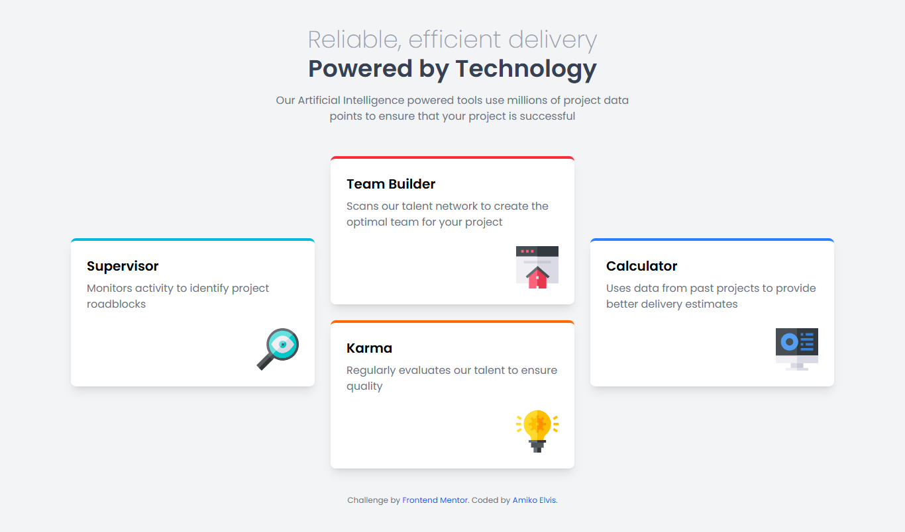

# Frontend Mentor - Four card feature section solution

This is a solution to the [Four card feature section challenge on Frontend Mentor](https://www.frontendmentor.io/challenges/four-card-feature-section-weK1eFYK). Frontend Mentor challenges help you improve your coding skills by building realistic projects.

## Table of contents

- [Overview](#overview)
  - [The challenge](#the-challenge)
  - [Screenshot](#screenshot)
  - [Links](#links)
- [My process](#my-process)
  - [Built with](#built-with)
  - [What I learned](#what-i-learned)
  - [Continued development](#continued-development)
  - [Useful resources](#useful-resources)
- [Author](#author)
- [Acknowledgments](#acknowledgments)

## Overview

### The challenge

Users should be able to:

- View the optimal layout for the site depending on their device's screen size

### Screenshot



### Links

- Solution URL: [Solution URL](https://github.com/amikoelvis/Four-Card-Feature-Section)
- Live Site URL: [Live site URL](https://four-card-feature-section-xi-umber.vercel.app/)

## My process

### Built with

- Semantic HTML5 markup
- Flexbox
- CSS Grid
- Mobile-first workflow
- [Tailwind CSS](https://tailwindcss.com/) - For styles

### What I learned

This project deepened my understanding of [CSS Grid](https://developer.mozilla.org/en-US/docs/Web/CSS/CSS_Grid_Layout) for creating complex, responsive layouts and [Tailwind CSS](https://tailwindcss.com/) for rapid styling. I also practiced semantic HTML to improve accessibility and used media queries to ensure the layout adapts across devices.

```html
<main class="grid gap-6 md:grid-cols-2 lg:grid-cols-3 max-w-6xl w-full">
  <div class="lg:row-span-2 lg:self-center">
    <div class="bg-white rounded-lg shadow-lg p-6 border-t-4 border-cyan-500">
      <h3 class="text-xl font-semibold">Supervisor</h3>
      <p class="mt-2 text-gray-500">
        Monitors activity to identify project roadblocks
      </p>
      
    </div>
  </div>
</main>
```

### Continued development

I plan to focus on:

- Enhancing accessibility by adding ARIA landmarks and ensuring keyboard navigation.
- Exploring Tailwind CSS animations for hover effects on cards.
- Optimizing image loading with modern formats like WebP.

### Useful resources

- [Tailwind CSS Documentation](https://tailwindcss.com/docs) - Helped me quickly style the layout with utility classes.

## Author

- Website - [Amiko Elvis](https://four-card-feature-section-xi-umber.vercel.app/)
- Frontend Mentor - [@amikoelvis](https://www.frontendmentor.io/profile/amikoelvis)
- Twitter - [@ElvisAmiko](https://www.twitter.com/ElvisAmiko)

**Note: Delete this note and add/remove/edit lines above based on what links you'd like to share.**

## Acknowledgments

Thank you to the Frontend Mentor community for inspiring me to tackle this challenge. I also appreciate the clear design files and style guide, which made it easier to achieve a pixel-perfect result.

```

```
